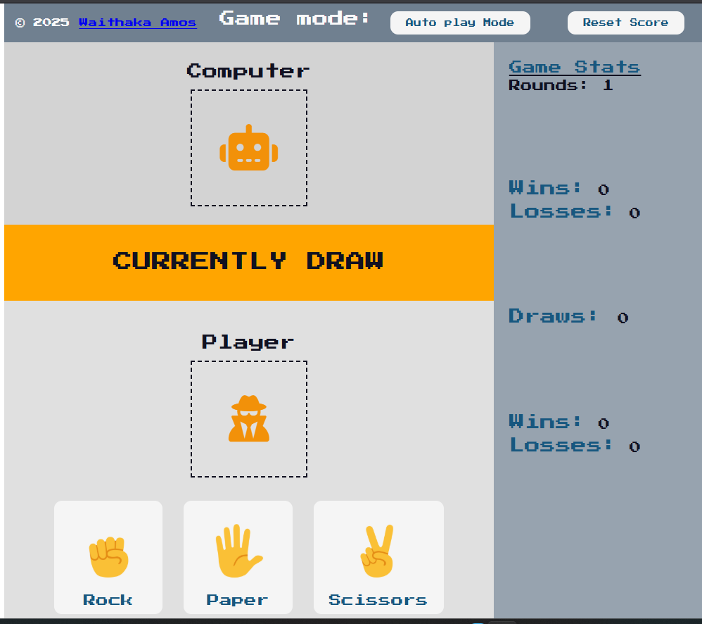

# ROCK PAPER SCISSORS GAME with AUTOPLAY MODE

An RPS GAME Project to help solidify JS concept on: 
  + THE DOM (Document Object Model)
  + JavaScript Functions
  + JavaScript-CSS interactions
  + Array and Object iteration, traversal and Methods
  + Provide a full HTML, CSS and JS inter-working Experience from page structure to styling and adding logic

## Features

✅ The game starts at a "Draw" state

✅ The game allows for live score tracking of wins and losses

✅ Emoji-based visual choices for player and computer

✅ Reset-score functionality to reset score back to 0

✅ Responsive and interactive UI

✅ Computer1 vs Computer2 Auto play (__Coming Soon__)

## Have a look: 



## Getting Started

1. First clone this repository and navigate into the target directory
```bash
git clone https://github.com/arman-develops/rock-paper-scissors.git
```
```bash
cd rock-paper-scissors
```
2. Install all necessary dependencies
```bash
npm install
```
3. Run the localhost server

```bash
npm run dev
```
## Live Site

Try it Yourself on: [RPS LIVE SITE](https://rock-paper-scissors-tan-theta.vercel.app/)

## Growing Together

